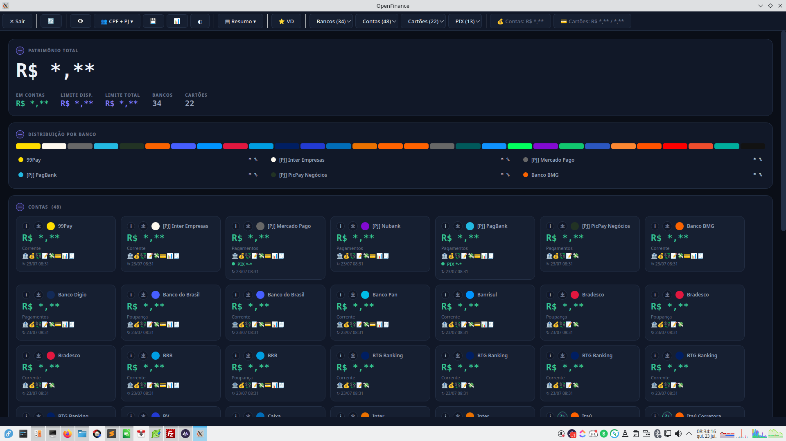
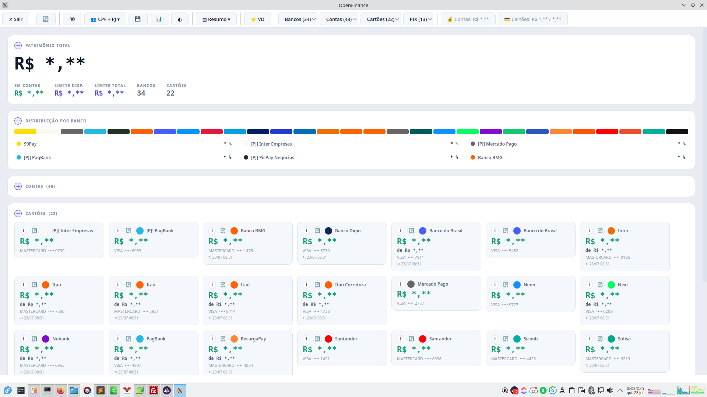
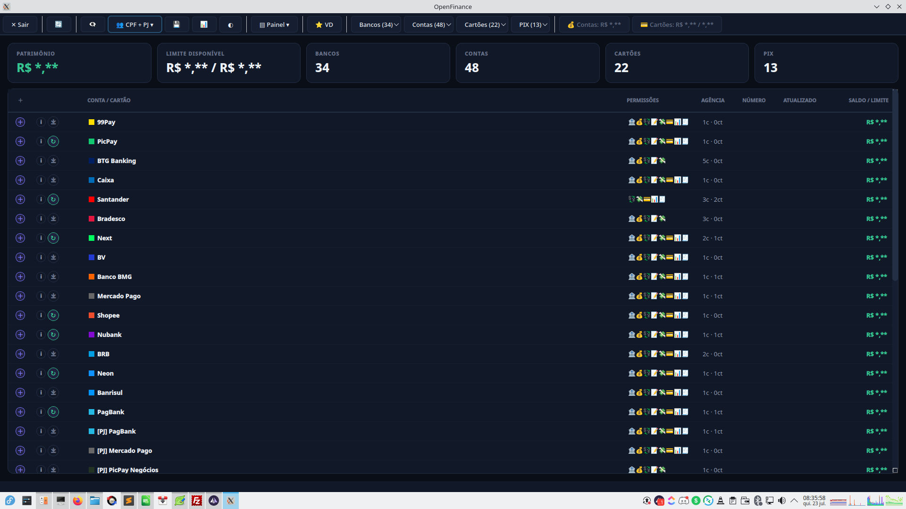
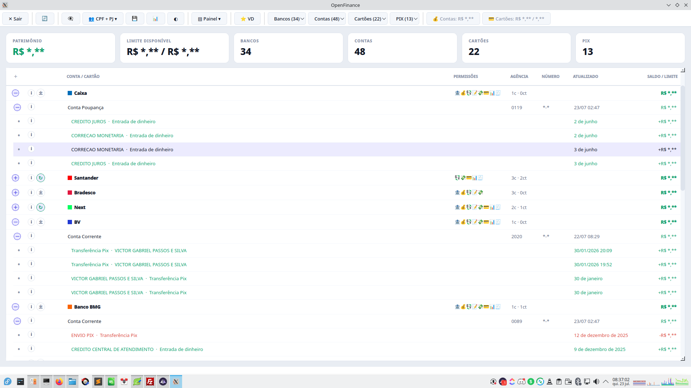
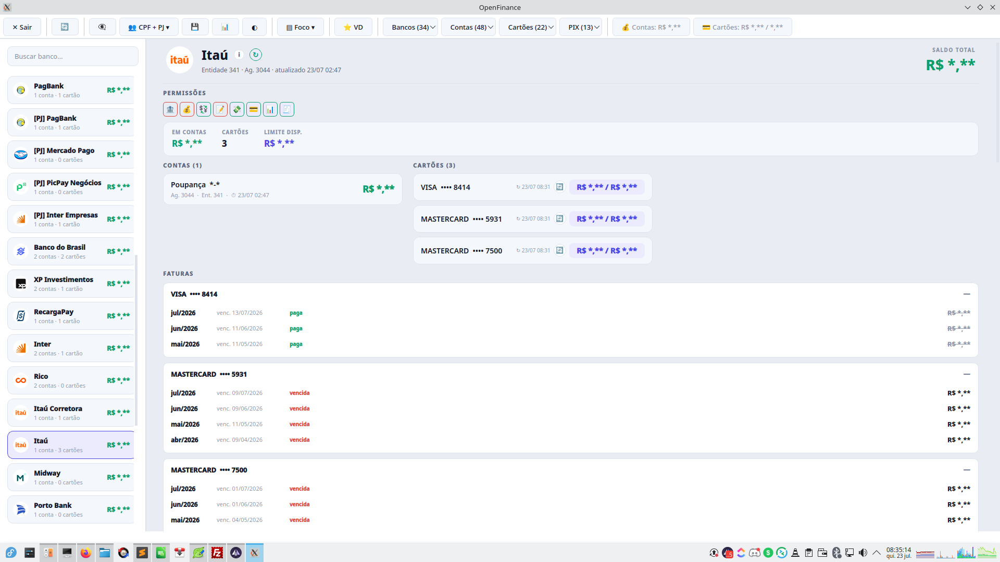
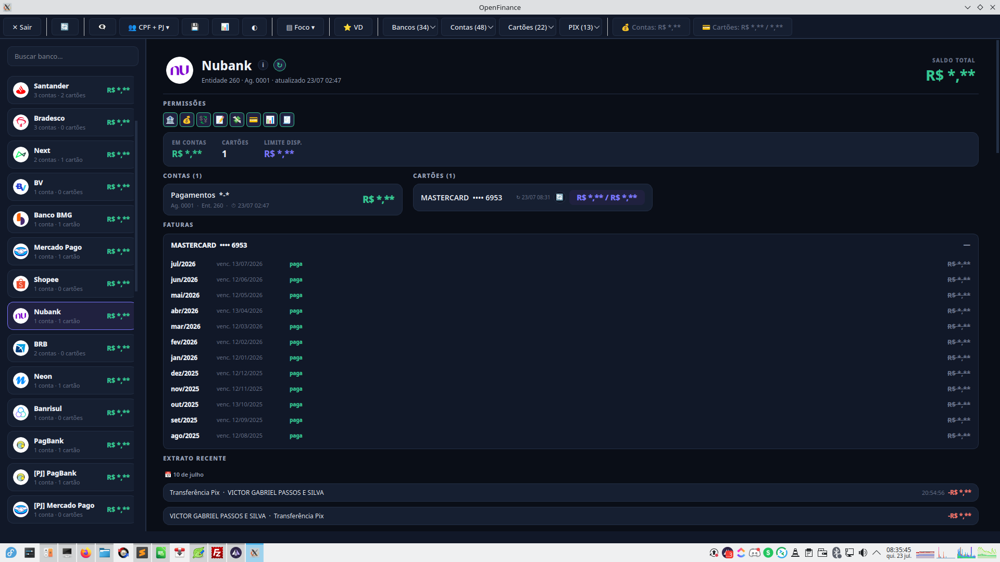

[📄 Página](https://victorgabriel.dev/projetos/OpenFinance-Dashboard) · [💻 GitHub](https://github.com/VictorGabriel7Dev/OpenFinance-Dashboard)

# OpenFinance Dashboard — Consolidador Financeiro Multi-Banco

   

> Visão unificada de contas, cartões de crédito e autorizações Pix do OpenFinance — direto no desktop, em C++.

### Resumo — patrimônio consolidado, distribuição por banco e contas

### Resumo — cartões de crédito

### Painel — tabela densa com totalizadores

### Painel — extrato recente por conta

### Foco — detalhe do banco: contas, cartões e faturas

### Foco — histórico de faturas e extrato (tema escuro)

> Capturas com os valores ocultos pelo modo de privacidade embutido.

---

## O que é

Software desenvolvido em **C++** para **Linux e Windows** que consome dados do ecossistema **OpenFinance** e consolida, em uma única tela, todas as informações financeiras de todos os bancos vinculados — contas, cartões de crédito e autorizações Pix.

Ideal para uso corporativo, gestão patrimonial, tesouraria e qualquer cenário onde visibilidade financeira consolidada é crítica.

---

## Funcionalidades

### Contas PF e PJ
Consolidação entre contas Pessoas Física (CPF) e contas Pessoas Jurídica (CNPJ).

### Três visões da mesma base
A mesma consolidação pode ser exibida em três layouts, alternáveis a qualquer momento:

| Visão | Uso |
|---|---|
| **Painel** | Tabela densa agrupada por banco, com totalizadores no topo e extrato expansível conta a conta |
| **Foco** | Lista de bancos à esquerda e o detalhe completo da instituição selecionada à direita |
| **Resumo** | Cartões visuais com patrimônio total, distribuição por banco e blocos de contas e cartões |

### Dados por instituição
Cada instituição financeira exibe:

- **Contas:** número da conta, tipo (corrente, poupança, pagamento) e saldo
- **Cartões de crédito:** número do cartão, bandeira (Visa, Mastercard, Elo, American Express), limite total e saldo atual
- **Pix:** indicação de autorização de uso e em qual conta está vinculada
- **Permissões:** quais consentimentos estão ativos naquela instituição

### Totalizadores globais
Exibidos automaticamente no topo da tela:

- Soma dos saldos de **todas as contas** de todos os bancos
- Soma dos **limites** de todos os cartões de crédito
- Soma dos **saldos** de todos os cartões de crédito

### Filtros de exibição
Permite alternar rapidamente entre visões:

| Filtro | Descrição |
|---|---|
| **CPF · PJ** | Alterna entre a sessão Pessoa Física, a Pessoa Jurídica ou ambas somadas |
| **Tudo** | Exibe todos os bancos vinculados |
| **Contas** | Apenas bancos com ao menos uma conta ativa |
| **Cartões** | Apenas bancos com ao menos um cartão de crédito |
| **Pix** | Apenas bancos com autorização de uso do Pix |
| **Favoritos** | Bancos marcados manualmente como favoritos |

### Extrato recente
Exibição e ocultação do extrato recente de todas as contas com um único comando. As transações capturadas ficam arquivadas localmente, então o histórico permanece disponível mesmo quando a instituição deixa de retorná-lo.

### Atualização sob demanda
Cada banco, conta e cartão pode ser recarregado individualmente, e cada item mostra a data e a hora da sua última atualização.

### Tema e privacidade
Alternância entre tema claro e escuro, e um modo que oculta todos os valores monetários — útil para apresentações, suporte e capturas de tela.

### Relatório exportável
Geração de relatório completo com todas as informações de todos os bancos, contas e cartões de crédito — pronto para auditoria, conciliação ou arquivamento.

---

## Stack técnica

| Item | Detalhe |
|---|---|
| Linguagem | C++ |
| Plataformas | Linux · Windows |
| Integração | OpenFinance Brasil |
| Interface | Desktop nativo (Qt6) |
| Armazenamento | Cache local para reabertura instantânea e histórico persistente |
| Exportação | Relatório em arquivo |

---

## Casos de uso corporativo

- **Tesouraria:** visão instantânea de saldos disponíveis em múltiplas instituições
- **Gestão patrimonial:** acompanhamento de limites, saldos e exposição em cartões
- **Compliance / Auditoria:** relatório consolidado rastreável de todas as contas
- **Open Banking interno:** base para integrações com ERPs e sistemas de gestão financeira

---

## Autor

**Victor Gabriel**  
· [victorgabriel.dev](https://victorgabriel.dev)  
· GitHub: [github.com/VictorGabriel7Dev](https://github.com/VictorGabriel7Dev)  
· LinkedIn: [in/victorgabriel-dev](https://www.linkedin.com/in/victorgabriel-dev)  
· WhatsApp: [@VictorGabriel_Dev](https://wa.me/@VictorGabriel_Dev)  
· Discord: `@VictorGabriel.dev`  
· Telegram: [t.me/VictorGabriel_Dev](https://t.me/VictorGabriel_Dev)  
· E-mail: contato@victorgabriel.dev  

---

## Palavras-chave

`openfinance` `open-banking` `open-finance-brasil` `consolidador-financeiro` `multi-banco` `gestao-financeira` `cartao-de-credito` `pix` `linux` `windows` `banking` `financial-dashboard`
